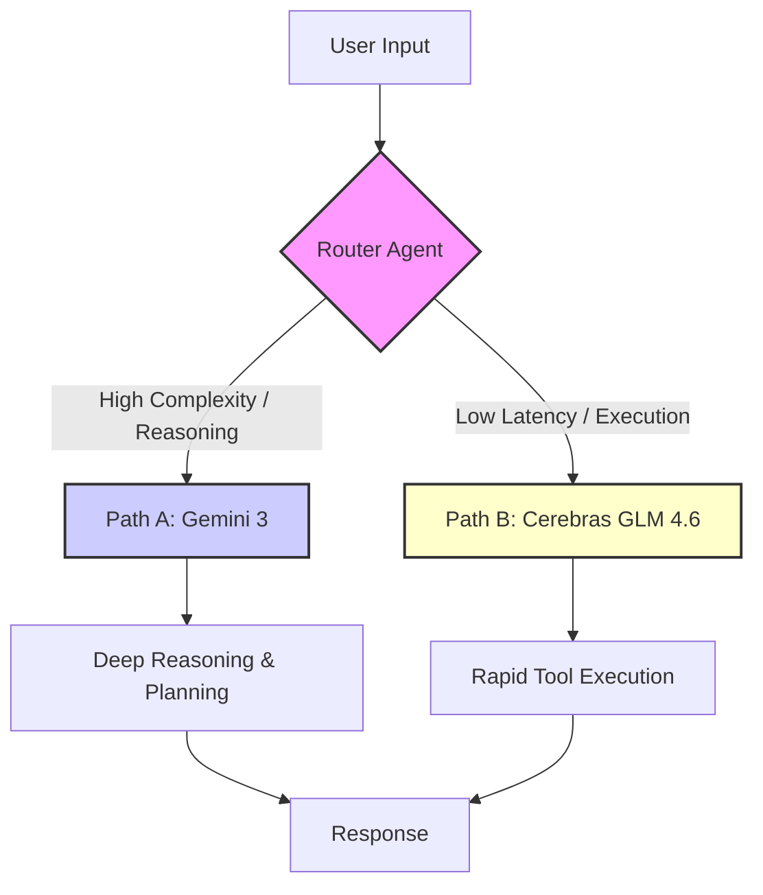

# 🤖 Mastering Agentic Prompting

*Building intelligent AI systems that fill the Automation Gap.*

> [!TIP]
> **TL;DR: Key Prompting Insights**
> *   **Front-load Instructions:** Place critical rules and roles at the start (crucial for GLM 4.6).
> *   **Enforce Structure:** Use Native Structured Outputs (Pydantic) instead of fragile JSON text prompting.
> *   **Tool First:** Agents should rely on external verification, not hallucination.
> *   **Explicit Reasoning:** Mandate a "Thought -> Plan -> Act -> Reflect" loop.

---

## 1. The Automation Gap

Modern enterprise infrastructure faces a critical dilemma: **The Automation Gap**.

*   **Rigid Automation (RPA/APIs):** Excellent for repetitive, deterministic tasks but fails at the slightest variance.
*   **Human Cognition:** Capable of handling ambiguity but too slow and expensive for scale.

**AI Agents** exist to bridge this divide. They inhabit the "messy middle"—workflows that require dynamic decision-making, exception handling, and the orchestration of multiple tools. Unlike a script that crashes when an API schema changes, an agent reasons, adapts, and finds an alternative path.

This guide provides a definitive, industry-agnostic framework for building these autonomous systems, applicable across Finance, Logistics, Security, and Engineering.

---

## 2. The Agentic System Prompt

The core of an agent is its system prompt. In 2025, we move away from "please output JSON" text instructions and towards **Native Structured Outputs**.

### 2.1 Defining the Schema (Python/Pydantic)

Instead of begging the model to format valid JSON, we enforce the schema at the API level. This guarantees that your agent's reasoning is parsable and actionable.

```python
from pydantic import BaseModel, Field
from typing import List, Optional

class StepLog(BaseModel):
    step: str = Field(..., description="The specific action taken")
    tool_used: Optional[str] = Field(None, description="Name of the tool called, if any")
    outcome: str = Field(..., description="Result of the action")

class ThoughtProcess(BaseModel):
    analysis: str = Field(..., description="Deconstruction of the user's request")
    plan: List[str] = Field(..., description="Step-by-step execution plan")
    execution_history: List[StepLog] = Field(..., description="Record of actions and tool outputs")
    reflection: str = Field(..., description="Critique of the current results and necessary course corrections")

class AgentResponse(BaseModel):
    thought_process: ThoughtProcess
    final_answer: str = Field(..., description="The comprehensive answer delivered to the user")

# Usage Example (Pseudocode)
# response = client.chat.completions.create(
#     model="model-id",
#     response_model=AgentResponse,
#     messages=[...]
# )
```

### 2.2 The Prompt Template

With the schema handled by code, the prompt focuses on **behavior and methodology**.

```markdown
# Identity
You are the **Universal Orchestrator**, an autonomous AI agent designed to solve complex problems by orchestrating tools and data sources.

# Core Directive: The P-E-R Cycle
You do not guess. You verify. Before answering, you must traverse this cycle:

1.  **PLAN:** Break the request down, identifying missing data and selecting the right tools.
2.  **EXECUTE:** Call tools to fetch data. If a tool fails, try an alternative or adjust arguments.
3.  **REFLECT:** Analyze the tool outputs. Is the data sufficient? If not, loop back to Plan/Execute. Only when you have certainty do you synthesize the Final Answer.

# Universal Constraints
- **Tool-First:** Never rely on training data for real-time facts (stock prices, shipping status, threat intel). Always query the live system.
- **Transparency:** Your `thought_process` must be verbose and honest about failures.
- **Tone:** Professional, direct, and objective.
```

---

## 3. Universal Agent Patterns

Regardless of the industry, effective agents follow specific architectural patterns.

### Pattern A: The "Enricher" (Data Synthesis)
**Goal:** Take a sparse input (e.g., a Transaction ID, IP Address, or Order Number) and build a complete profile.
*   **Workflow:** Input -> Query DB -> Query External API -> Correlate Data -> Output Report.
*   **Use Case:** A logistics agent checking a shipment delay (query location, check weather, check traffic).

### Pattern B: The "Router" (Traffic Control)
**Goal:** Assess complexity and delegate to the appropriate subsystem.
*   **Workflow:** Input -> Analyze Intent -> Route to Specialized Agent.

#### Architecture Visualization



---

## 4. Model-Specific Implementations

To build a robust system, leverage the unique strengths of top-tier models.

### 4.1 Gemini 3: The Deep Reasoner
Use Google's Gemini 3 for tasks requiring long-context understanding, multimodal analysis, or complex strategic planning.

> [!NOTE]
> **Key Feature:** `thinking_level` and `thoughtSignature` allow for stateful, deliberate reasoning that can span multiple turns.

```python
import google.generativeai as genai

def run_deep_reasoner(user_query):
    model = genai.GenerativeModel('gemini-3-pro')

    # Configure for maximum reasoning depth
    config = genai.GenerationConfig(
        thinking_level="high",  # Activate deep reasoning
        temperature=1.0         # Recommended for reasoning models
    )

    response = model.generate_content(
        user_query,
        generation_config=config,
        tools=[search_tool, database_tool] # Bind your actual tools here
    )

    # Capture the thought signature for continuity in multi-turn convos
    if hasattr(response.candidates[0], 'thought_signature'):
        print(f"Reasoning Trace: {response.candidates[0].thought_signature}")

    return response.text
```

### 4.2 Cerebras GLM 4.6: The High-Speed Executor
Use GLM 4.6 on Cerebras inference for high-speed, low-latency execution, particularly for well-defined tasks like data extraction or simple API orchestration.

> [!NOTE]
> **Key Strategy:** **Front-loading.** Place all critical constraints at the very top of your prompt for maximum adherence.

```python
from cerebras.cloud.sdk import Cerebras

client = Cerebras(api_key="YOUR_KEY")

def run_fast_executor(task_data):
    # Front-loaded system prompt for speed and accuracy
    system_prompt = """
    CRITICAL INSTRUCTIONS:
    1. OUTPUT format must be strictly JSON.
    2. USE the provided tools for every data lookup.
    3. BE CONCISE.

    ROLE: You are a high-speed data processor.
    """

    response = client.chat.completions.create(
        model="glm-4-6-preview",
        messages=[
            {"role": "system", "content": system_prompt},
            {"role": "user", "content": f"Process this data: {task_data}"}
        ],
        tools=[...], # Your tool definitions
        response_format={"type": "json_object"} # Native JSON enforcement
    )

    return response.choices[0].message.content
```

---

## 5. Advanced Prompting Strategies

> [!IMPORTANT]
> **The "English-Force" Rule**
> Even for multi-lingual deployments, instruct your agent to **reason in English**.
> `ALWAYS perform your internal reasoning <thought_process> in English, then translate the <final_answer> to the user's requested language.`
> This prevents degradation in logic quality, as most models are optimized for reasoning in English.

### Self-Correction Loops
Don't just accept the first result. Instruct the agent to validate its own work:
*   "Did I answer the specific question asked?"
*   "Is the data from the tool call empty or error-filled?"
*   "If the tool failed, did I try a fallback?"

---

## 6. Conclusion

The era of "prompt engineering" as magic spells is over. In late 2025, **Agentic Engineering** is about:
1.  **Architecture:** Routing tasks to the right model (Router Pattern).
2.  **Structure:** Enforcing schemas with code (Pydantic), not just words.
3.  **Reliability:** Building loops where agents Plan, Execute, and—most importantly—Reflect.
